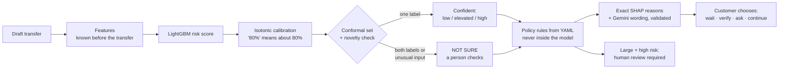
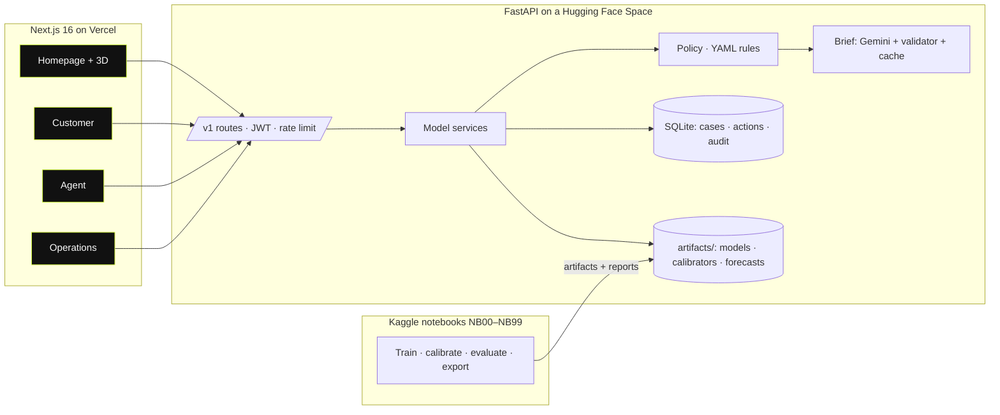

<p align="center">
  
</p>

<p align="center">
  <a href="https://github.com/ABRUBAB/takaresolve-ai-hackathon-2026/actions/workflows/ci.yml"></a>
  
  
  
  
  
</p>

<p align="center">
  <b>Live demo</b>: <i>coming soon</i> &nbsp;·&nbsp; <b>Video</b>: <i>coming soon</i> &nbsp;·&nbsp;
  <a href="docs/report/README.md"><b>Report</b></a> &nbsp;·&nbsp; <a href="notebooks/README.md"><b>Notebooks</b></a> &nbsp;·&nbsp;
  <a href="reports/README.md"><b>Measured results</b></a>
</p>

---

## UVERA in 30 seconds

**Rina** gets a call: *"You won a prize. Send Tk 3,000 to unlock it."* She opens her wallet to send the money.

**Before she taps Confirm**, UVERA checks the transfer. The receiving wallet is two days old and is taking money from many
strangers. UVERA pauses her and explains why in simple Bangla and English. She can wait, verify the number, ask someone she
trusts, or still continue. **UVERA never blocks her.**

Meanwhile, the same scammer's wallet tries to turn stolen money into cash through a shop that misuses **Bangla QR** as a cash
machine. **QR Shield** notices the pattern. **Karim**, a nearby agent, sees why his cash-out business is dropping.
**Nusrat** in operations gets **one linked case** instead of five separate alerts. It comes with an evidence graph, a plain
summary, and a dispute deadline clock. **The AI recommends. A person decides.**

<p align="center"></p>

---

## The problem (2026)

| What is happening | Why it matters | Source |
|---|---|---|
| Customers are tricked into **sending money themselves** (fake prizes, fake customer care, "wrong transfer, send it back") | Fraud rules look at the transaction, but the scam happens in the customer's head, a few seconds earlier | [The Daily Star — "One in 10 MFS users victims of fraud"](https://www.thedailystar.net/news/bangladesh/crime-justice/news/one-10-mfs-users-victims-fraud-2994376) |
| News reports in Sept 2026 describe **Bangla QR used as a disguised cash-out**: a "payment" with no goods, cash handed back | It bypasses cash-out charges and limits, and takes income away from agents | [TBS News — "How the abuse of Bangla QR threatens the country's MFS ecosystem"](https://www.tbsnews.net/bangladesh/how-abuse-bangla-qr-threatens-countrys-mfs-ecosystem-1538591) |
| New Bangla QR **dispute rules with fixed deadlines** are reported to start on 1 Dec 2026 | Operations teams must link evidence and act on time | [The Daily Star — auto-refund rules](https://www.thedailystar.net/business/economy/news/customers-get-auto-refund-if-bangla-qr-transactions-fail-4284581) |

> UVERA does **not** claim anything about any company's internal data. It responds to industry-wide pressures that every
> mobile financial service faces, using only synthetic and open data.

---

## One website, three areas (and a Trust Center)

| Area | Who | What they get | AI inside |
|---|---|---|---|
| **Homepage** `/` | Everyone | The story, a live 3D Trust Field drawn from a real sample of the synthetic world (customers, agents & shops, linked cases; scam money stops at a pause ring and rises into its case), a live Pause Check against the API, and measured results | — |
| **Customer** `/customer` | Rina | **Pause Check** before sending (pause · not sure · low risk; wait, verify, ask someone, or continue) · **Scam Text Check** for suspicious SMS · **Cash-Flow Guardian** with safe savings plans | AI-1 · AI-2 · AI-3 · AI-7 |
| **Agent** `/agent` | Karim | **Liquidity Copilot**: cash to hold for a 90%-safe day, riskiest days, peers · **QR pressure** in his zone (zone level only) | AI-4 · AI-5 |
| **Operations** `/ops` | Nusrat | **Case queue** by risk and deadline · replayable **money-path graph** · **grounded brief** · **dispute clock** · audited human decisions · **QR Shield watchlist** | AI-5 · AI-6 · AI-7 · rules |
| **Trust Center** `/trust` | Judges, reviewers | Every metric with its source notebook, fairness slices, data card, live API health and limitations | all |

Every area has a **“Behind the screen”** panel that shows the raw model output (score, calibrated probability, conformal
set, unusual-input flag, TreeSHAP weights, rules fired, brief source, trace id) next to what the person sees.

---

## How a decision is made



**Four kinds of output are always labelled differently in the UI:** model estimate · business rule · generated wording ·
assumption. The language model **never decides anything**. It only rewrites evidence, and a validator rejects any text that
adds numbers, promises safety, or hides uncertainty.

---

## The seven AI components

| # | AI | What it does | Model (chosen by measurement) | How we know it works | Uncertainty |
|---|---|---|---|---|---|
| 1 | **Pause Check** | Scam risk of a transfer before Confirm | LightGBM vs rule baseline, logistic regression, XGBoost, CatBoost | 5-fold StratifiedGroupKFold × 5 seeds; one test on unseen customers | Isotonic calibration, Mondrian conformal, novelty flag |
| 2 | **Scam Text Sentinel** | Is a pasted message a scam, which kind, which phrases | TF-IDF LR vs BGE-M3 + LR vs BGE-M3 + evidential head | Held-out *writing style*, plus an outside test on the UCI SMS Spam set | Calibrated verdict, evidential "I don't know" mass |
| 3 | **Cash-Flow Guardian** | 7-day cash-flow forecast, chance of running short | Seasonal-naive vs LightGBM-quantile vs **Chronos-2** | Rolling-origin backtest (MASE, pinball, coverage) | 10/50/90% bands, recalibrated probability |
| 4 | **Agent Liquidity Copilot** | 7-day cash demand, chance of a stock-out | Same three forecasters | Same backtest; Brier vs a historical baseline | 10/50/90% bands |
| 5 | **QR Shield** | Shops using Bangla QR as a cash machine | Peer z-scores + IsolationForest + LightGBM | One disguise family **never seen in training**; precision@k per week; false alarms on honest round-price shops | Calibration + conformal "grey: needs review" |
| 6 | **Case Linker** | Many alerts → one case with an evidence graph | Time-respecting path tracing + graph linking (NetworkX) | Same-mule alerts linked, case purity, analyst items saved | Weak links shown as weak |
| 7 | **Grounded Brief** | Plain Bangla/English explanation | Gemini API (structured output) + policy-card retrieval | Validator pass rate; prompt-injection test set | Inherits upstream state; template fallback |

Each AI has its own Kaggle notebook: see [`notebooks/`](notebooks/README.md).

---

## Why you can trust the numbers

- **Synthetic, but not easy.** The world is generated from a fixed seed: 20,000 customers, 600 agents, 2,500 merchants, 120 days.
  Labels come from a hidden scammer process, not from feature rules. Honest look-alikes are included (Eid transfers, rent, fixed-price shops), 10% of scam labels are lost, and an equal number of false reports are added.
  **No single feature may predict the label with AUC above 0.80** (checked in code and in CI).
- **No leakage.** Every feature uses only information from before the transfer. The splits are by time and by customer, and test customers never appear in training.
  Text is split by writing style. One QR disguise family is held out completely. Thresholds are frozen on validation, and the test set is used **once**.
- **Honest baselines.** Every model is compared with a simpler method. Where the advanced model does not win, we keep the simple one.
- **Every number has a file.** Results live in [`reports/`](reports/README.md), written by the notebooks. Nothing on the website is typed by hand.

> **Status:** the full-scale Kaggle runs are in progress. The results table will appear here once
> [`reports/summary.md`](reports/README.md) is generated by NB99.

---

## Responsible AI (Guideline §14)

| Principle | In the product |
|---|---|
| **Privacy** | Only synthetic or open-licensed data. Random IDs, masked logs, and only synthetic evidence is sent to the LLM. |
| **Explainability** | Exact TreeSHAP reasons, faithful phrase occlusion for text, evidence graphs for cases, and policy-card citations. |
| **Fairness** | Error rates by account age, zone, channel, language and merchant size are reported, including findings that look bad. |
| **Security** | JWT roles, rate limits and strict schemas. Untrusted text is treated as data, never as instructions. Prompt-injection tests run on every brief. |
| **Human oversight** | The customer is never blocked. Every hold or merchant cap needs a staff click with a reason, recorded in an audit log. |
| **Transparency** | Model estimate, business rule, generated wording and assumption are always labelled differently. |
| **No harmful automation** | No automatic approval or denial of money, and no lending decisions. |

---

## Architecture



More diagrams: [`docs/architecture.md`](docs/architecture.md).

---

## Tech stack

| Layer | Choice |
|---|---|
| Data & ML | Python 3.12 · pandas · pyarrow · scikit-learn · **LightGBM** · XGBoost · CatBoost · NetworkX · PyTorch |
| Pretrained models | **Chronos-2** (`amazon/chronos-2`, Apache-2.0) · **BGE-M3** (`BAAI/bge-m3`, MIT) |
| LLM | **Gemini API** (`gemini-3.8-flash`, fallback `gemini-3.5-flash-lite`) via `google-genai`, structured JSON output |
| API | FastAPI · Pydantic v2 · Uvicorn · SQLite |
| Web | Next.js 16 · React 19 · TypeScript · Tailwind CSS · shadcn/ui · Magic UI · Motion · GSAP · React Three Fiber · Paper Shaders · Recharts · Cytoscape.js |
| Training | Kaggle notebooks (CPU / T4 GPU) |
| Hosting | Vercel (web) · Hugging Face Docker Space (API) |
| Quality | pytest · ruff · ESLint · Playwright · GitHub Actions |

Every third-party resource and its license is listed in [`docs/third_party.md`](docs/third_party.md).

---

## Requirements
- Python **3.12** (3.11+ works) and pip
- Node.js **22 LTS** and npm
- ~4 GB free RAM (8 GB if the BGE-M3 text model is enabled)
- Docker (optional, for `docker compose`)
- No GPU needed to run the app. Training notebooks run on Kaggle.
- A **Gemini API key** is optional. Without it, the app serves cached briefs and template text.

## Installation and setup

```bash
git clone https://github.com/ABRUBAB/takaresolve-ai-hackathon-2026.git
```

```bash
cd takaresolve-ai-hackathon-2026
```

```bash
cp .env.example .env
```

```bash
python -m venv .venv
```

Activate it (`source .venv/bin/activate` on macOS/Linux, `.venv\Scripts\activate` on Windows), then:

```bash
pip install -e "./ml[dev]" -e "./backend[dev]"
```

```bash
cd frontend && npm install
```

## Environment variables

| Variable | Purpose | Example (placeholder) |
|---|---|---|
| `JWT_SECRET` | Signs demo-role tokens | `change-me` |
| `ALLOWED_ORIGINS` | CORS allow-list (comma separated) | `http://localhost:3000` |
| `MODEL_DIR` | Folder with exported model artifacts | `../artifacts` |
| `WORLD_DIR` / `WORLD_SCALE` | Where the seeded synthetic world is cached (generated on first start) | `../_outputs/world_full` / `full` |
| `DB_PATH` | SQLite file for the audit log of human decisions | `../_outputs/uvera.db` |
| `LLM_MODE` | `cached` (NB07 briefs, then template) or `live` (Gemini → validator → template) | `cached` |
| `GEMINI_API_KEY` | Gemini API key, only for `LLM_MODE=live` (never commit it) | *(empty)* |
| `GEMINI_MODEL` | Gemini model ID | `gemini-3.8-flash` |
| `DEMO_MODE` | Seeded scenarios and demo logins | `true` |
| `RATE_LIMIT_PER_MINUTE` | API rate limit per client | `120` |
| `LOG_LEVEL` | Log level | `info` |
| `NEXT_PUBLIC_API_BASE` | API URL used by the web app | `http://localhost:8000` |

## Run

```bash
cd backend && uvicorn app.main:app --port 8000
```

The API generates (once) and loads the seeded world, then warms up the AI engines in the background (about a minute);
the website shows a “waking up” state meanwhile. It serves the official Kaggle results in `artifacts/`. If a notebook has
not been run yet, build a quick local copy of every model first:

```bash
python scripts/build_dev_artifacts.py
```

```bash
cd frontend && npm run dev
```

Or run everything in containers:

```bash
docker compose up --build
```

The API docs are at `http://localhost:8000/docs` and the web app at `http://localhost:3000`.

## Build

```bash
cd frontend && npm run build
```

```bash
docker build -f backend/Dockerfile -t uvera-api .
```

## Live deployment
The website runs on Vercel and the API on a Hugging Face Docker Space; step-by-step setup is in [docs/deploy.md](docs/deploy.md).
The live links will be added at the top of this file.

## Testing

```bash
pytest -q ml/tests
```

```bash
cd backend && pytest -q
```

```bash
ruff check ml backend
```

```bash
cd frontend && npm run lint
```

The ML tests check that the synthetic world is deterministic, that no single feature gives the label away, that test customers never appear in training, conformal coverage, the decision policy (the customer is never blocked; uncertain cases go to a person), and that the brief validator blocks invented numbers, unsafe claims and injected instructions.

## Other configuration
| Path | What it controls |
|---|---|
| [`configs/assumptions.yaml`](configs/assumptions.yaml) | Every synthetic-world assumption, splits, cross-validation, impact assumptions |
| [`configs/patterns.yaml`](configs/patterns.yaml) | Injected scam families and QR disguise families |
| [`configs/thresholds.yaml`](configs/thresholds.yaml) | Alert budgets and conformal levels (thresholds are frozen on validation data) |
| [`configs/rules/`](configs/rules) | Business rules kept outside the models: actions, limits, dispute deadlines (marked unverified until checked against the official circular) |
| [`configs/flags.yaml`](configs/flags.yaml) | Feature flags for quick changes |
| [`policy_cards/`](policy_cards) | Short safety cards (our own words) cited by AI-7 |
| [`notebooks/`](notebooks/README.md) | How to reproduce every model on Kaggle |

## Repository map

```
ml/uvera_ml/      synthetic world, features, models (AI-1…AI-7), uncertainty, XAI, graph, forecasting, evaluation
notebooks/        one Kaggle notebook per AI (NB00–NB07) + NB99 evaluation
backend/          FastAPI service
frontend/         Next.js website (homepage + customer / agent / operations areas)
configs/          assumptions, patterns, thresholds, business rules, feature flags
artifacts/        exported models and scores (written by the notebooks)
reports/          measured results and figures (written by the notebooks)
docs/             architecture, data card, system card, model cards, report, third-party licenses
```

## Limitations
Results on synthetic data show that the pipeline works. They do not show real-world accuracy. Real deployment would need
governed, anonymised data, recalibration, and a shadow-mode pilot (see [`docs/production_path.md`](docs/production_path.md)).

## Team and disclosure
Built during the official 72-hour window of AI DEV FEST 2026 (DIU-CPC × upay). Every external dataset, model, API and
component is disclosed in [`docs/third_party.md`](docs/third_party.md).

## License
MIT for our code: see [`LICENSE`](LICENSE). Third-party components keep their own licenses.
