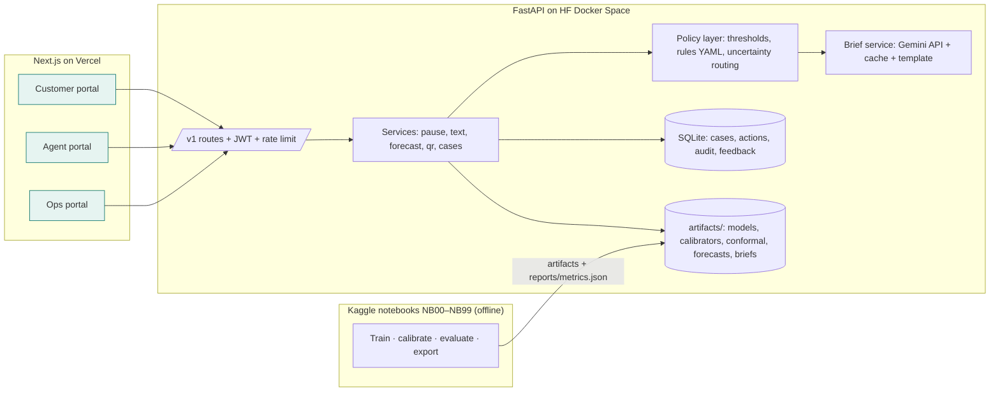
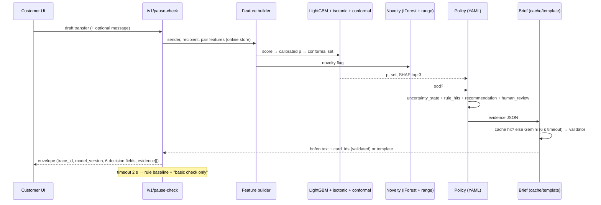
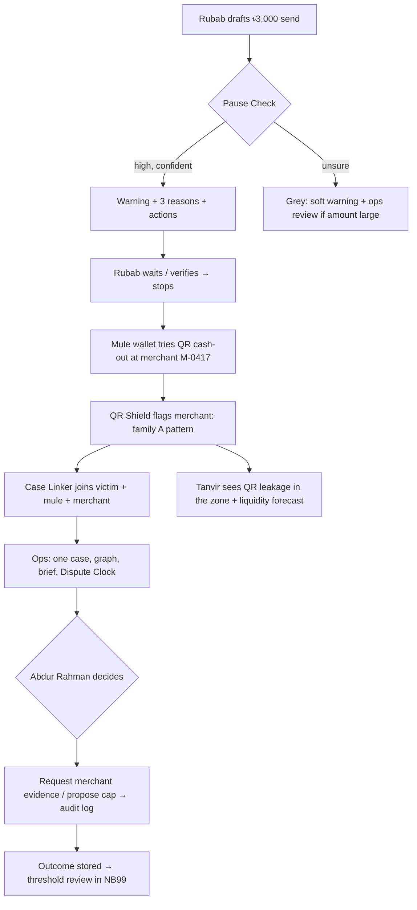

# Architecture

Rules and ML predictions are kept separate (Guideline p9 §12).

### M.1 System architecture

```mermaid
flowchart LR
  subgraph Web["Next.js on Vercel"]
    C[Customer portal]:::p
    A[Agent portal]:::p
    O[Ops portal]:::p
  end
  subgraph API["FastAPI on HF Docker Space"]
    R[/v1 routes + JWT + rate limit/]
    S[Services: pause, text, forecast, qr, cases]
    P[Policy layer: thresholds, rules YAML, uncertainty routing]
    L[Brief service: Gemini API + cache + template]
    DB[(SQLite: cases, actions, audit, feedback)]
    ART[(artifacts/: models, calibrators, conformal, forecasts, briefs)]
  end
  subgraph Kaggle["Kaggle notebooks NB00–NB99 (offline)"]
    K[Train · calibrate · evaluate · export]
  end
  C & A & O --> R --> S --> P
  S --> ART
  P --> L
  S --> DB
  K -- artifacts + reports/metrics.json --> ART
  classDef p fill:#e6f4f1,stroke:#0f766e
```

### M.2 Inference flow (Pause Check)

```mermaid
sequenceDiagram
  participant U as Customer UI
  participant API as /v1/pause-check
  participant F as Feature builder
  participant M as LightGBM + isotonic + conformal
  participant N as Novelty (IForest + range)
  participant Pol as Policy (YAML)
  participant B as Brief (cache/template)
  U->>API: draft transfer (+ optional message)
  API->>F: sender, recipient, pair features (online store)
  F->>M: score → calibrated p → conformal set
  F->>N: novelty flag
  M-->>Pol: p, set, SHAP top-3
  N-->>Pol: ood?
  Pol->>Pol: uncertainty_state + rule_hits + recommendation + human_review
  Pol->>B: evidence JSON
  B->>B: cache hit? else Gemini (6 s timeout) → validator
  B-->>API: bn/en text + card_ids (validated) or template
  API-->>U: envelope (trace_id, model_version, 6 decision fields, evidence[])
  Note over API: timeout 2 s → rule baseline + "basic check only"
```

### M.3 User flow (golden thread)

```mermaid
flowchart TD
  A[Rubab drafts ৳3,000 send] --> B{Pause Check}
  B -- high, confident --> C[Warning + 3 reasons + actions]
  B -- unsure --> D[Grey: soft warning + ops review if amount large]
  C --> E[Rubab waits / verifies → stops]
  E --> F[Mule wallet tries QR cash-out at merchant M-0417]
  F --> G[QR Shield flags merchant: family A pattern]
  G --> H[Case Linker joins victim + mule + merchant]
  H --> I[Ops: one case, graph, brief, Dispute Clock]
  I --> J{Abdur Rahman decides}
  J --> K[Request merchant evidence / propose cap → audit log]
  G --> L[Tanvir sees QR leakage in the zone + liquidity forecast]
  K --> M[Outcome stored → threshold review in NB99]
```
