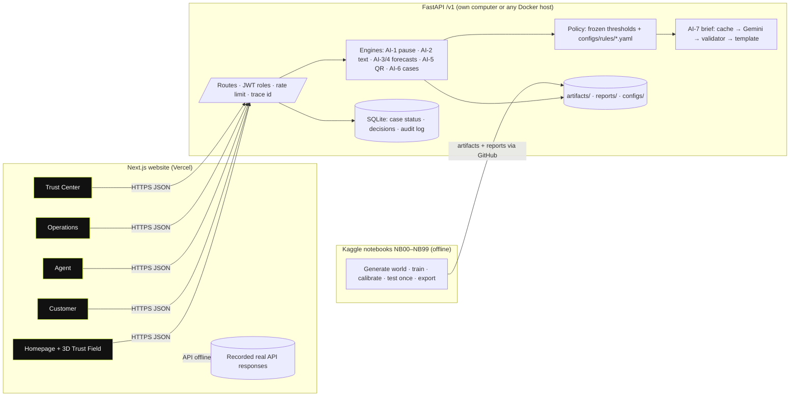
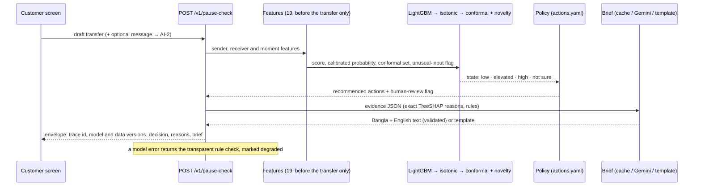
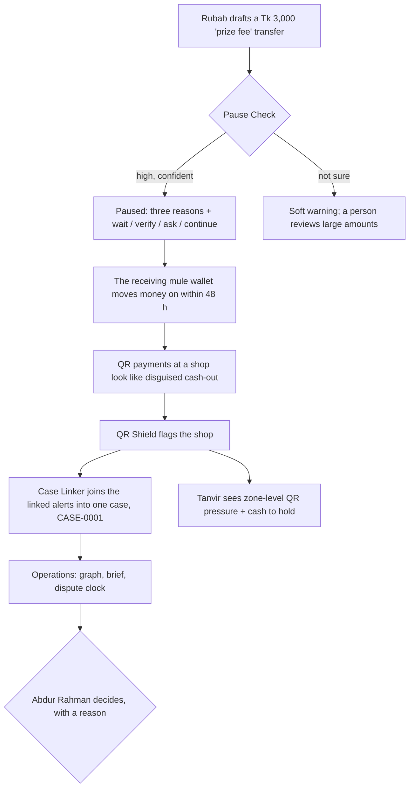

# Architecture

Business rules are kept separate from model predictions (Guideline p9 §12): models estimate, YAML rules decide which
actions are offered, and a person approves anything that holds money.

## 1. System

## 2. One Pause Check request

## 3. The golden thread across the three areas

## 4. Hosting
- **Website:** Vercel. With no live API connected, it plays back real responses recorded from the API for every demo
  scenario, so the link always works.
- **Live API:** our own computer (or any Docker host), optionally made public with a Cloudflare Quick Tunnel or
  Tailscale Funnel. See [`deploy.md`](deploy.md).
