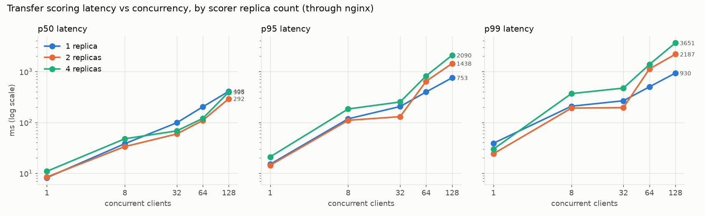
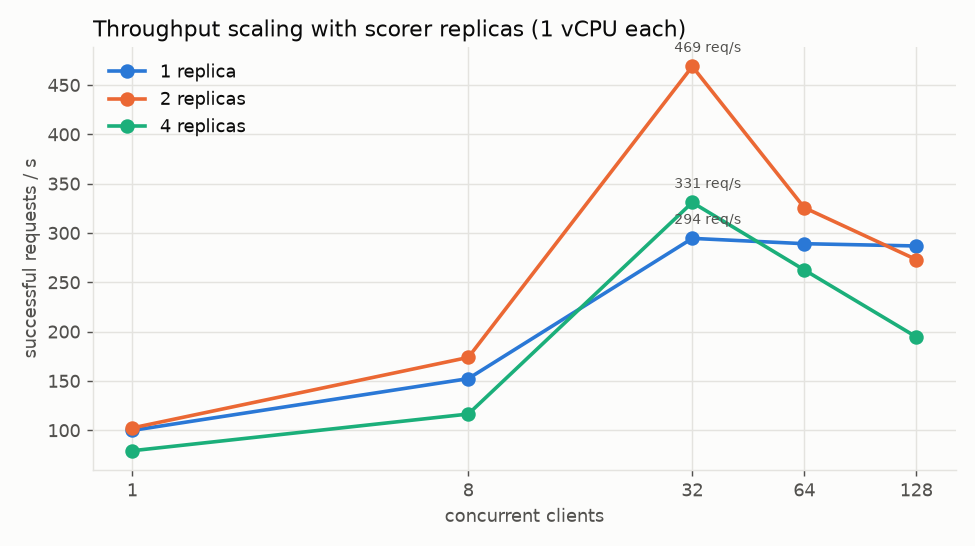
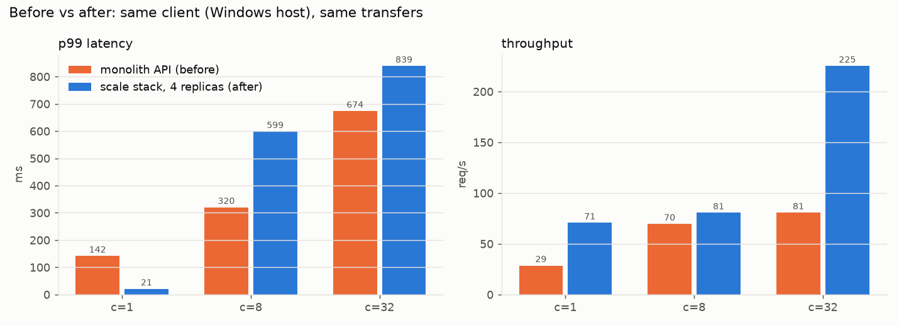
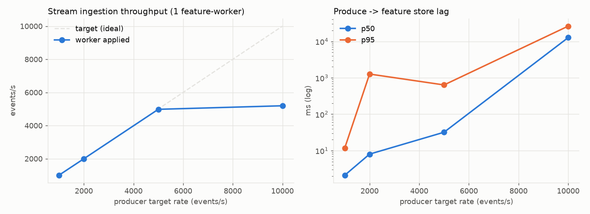
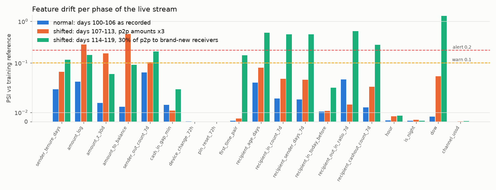

# UVERA scalability results

Measured on one laptop, not a cluster. Every number below is generated by `deploy/scale/report.py` from the raw JSON files in this folder. How to reproduce: `deploy/scale/README.md`.

## Hardware and setup

| item | value |
|---|---|
| host | one laptop: AMD Ryzen 5 5600H (6 cores / 12 threads), 15 GB RAM, Windows 11 Home |
| container runtime | Docker Desktop 29.4.2 on WSL2; Linux VM sees 12 CPUs and ~7.4 GiB RAM |
| contention | load generator, nginx, Redis, Postgres, Prometheus and all replicas share the same 12 threads; other ML jobs were running on the host (about 2 GB host RAM free) |
| scorer replica | 1 uvicorn process (uvloop, httptools), Docker limit 1 vCPU and 512 MB |
| feature worker | 1 asyncio process, Docker limit 1 vCPU |
| load generator | asyncio + httpx, up to 4 processes, closed loop, inside the Docker network (sections 1, 3-5); on the Windows host for section 2 |
| model | AI-1 LightGBM, 482 trees, 19 features, isotonic + Mondrian conformal + robust novelty; AI-2 TF-IDF + LR |
| data | synthetic UVERA-World full scale: 20,000 customers, 120 days, 2,203,725 events + 7,650 security events |
| monolith_memory | 1,693 MB private bytes (876 MB resident at the time; host under memory pressure) |
| monolith_startup | 81.5 s from start to ready (loads the whole synthetic world and all engines) |
| scorer replica footprint | 167 MB RSS at idle, 1.24 s from start to ready (model files only, no world in memory) |

## 1. Transfer scoring: concurrency x replicas

`POST /score/transfer` through nginx; each request reads the sender and receiver features from Redis (Lua), computes the 19 AI-1 features, runs LightGBM + isotonic + conformal + novelty + policy, explains with TreeSHAP when the risk is not low, and queues the decision for Postgres (batched COPY). Closed-loop clients, 30 s per point after a 5 s warm-up, client inside the Docker network. Each scorer replica is limited to 1 vCPU.

| replicas | clients | req/s | p50 ms | p95 ms | p99 ms | max ms | errors | CPU %/replica | RSS MB/replica |
|---|---|---|---|---|---|---|---|---|---|
| 1 | 1 | 99.8 | 8.2 | 15.0 | 38.9 | 143.7 | 0.00% | 42.2 | 126.0 |
| 1 | 8 | 152.3 | 38.1 | 117.5 | 207.8 | 533.6 | 0.00% | 76.7 | 129.8 |
| 1 | 32 | 294.5 | 98.4 | 204.9 | 266.1 | 354.2 | 0.00% | 101.0 | 126.1 |
| 1 | 64 | 289.1 | 202.2 | 395.6 | 499.6 | 735.6 | 0.00% | 101.3 | 128.1 |
| 1 | 128 | 286.8 | 407.9 | 752.9 | 930.2 | 1,566.9 | 0.00% | 100.3 | 131.0 |
| 2 | 1 | 102.3 | 8.4 | 14.4 | 24.2 | 65.1 | 0.00% | 33.7 | 131.1 |
| 2 | 8 | 173.8 | 33.4 | 109.9 | 190.7 | 532.2 | 0.00% | 53.5 | 129.1 |
| 2 | 32 | 468.8 | 59.2 | 129.7 | 195.4 | 577.5 | 0.00% | 97.4 | 130.7 |
| 2 | 64 | 325.6 | 109.4 | 643.0 | 1,122.8 | 2,372.1 | 0.02% | 86.2 | 129.6 |
| 2 | 128 | 273.0 | 292.2 | 1,438.0 | 2,187.2 | 5,155.5 | 0.00% | 69.7 | 129.4 |
| 4 | 1 | 79.2 | 10.9 | 21.0 | 29.8 | 143.0 | 0.00% | 25.3 | 130.8 |
| 4 | 8 | 116.4 | 47.6 | 183.5 | 368.1 | 795.8 | 0.00% | 26.8 | 129.6 |
| 4 | 32 | 330.9 | 68.1 | 251.7 | 472.3 | 1,570.4 | 0.00% | 59.6 | 129.6 |
| 4 | 64 | 262.5 | 119.9 | 818.8 | 1,373.3 | 2,874.7 | 0.00% | 51.1 | 129.4 |
| 4 | 128 | 194.6 | 395.1 | 2,090.3 | 3,650.9 | 6,069.7 | 0.00% | 44.4 | 127.2 |

CPU % and memory per scorer replica are `docker stats` samples taken during each run (mean CPU over the replicas; 100% = the 1 vCPU limit). All services and the load generator share this laptop, so these runs do not isolate a single bottleneck.

Other containers during the last run (4 replicas, 128 clients):

| container | CPU % (mean) | memory MB (max) |
|---|---|---|
| feature-worker-1 | 1.4 | 62.7 |
| loadgen-run-a5ae9565e6eb | 191.4 | 212.1 |
| nginx-1 | 14.0 | 10.9 |
| postgres-1 | 20.7 | 146.8 |
| prometheus-1 | 1.2 | 66.3 |
| redis-1 | 19.7 | 86.5 |

## 2. Before vs after (same Windows-host client, same transfers)

Before = the existing monolithic FastAPI app (`backend/`, world + all engines in one process, `POST /v1/pause-check`). Its endpoint does more per call (counterfactual grid of 24 predictions, note check, brief, always-on TreeSHAP), so this compares the deployable architectures, not identical work.

| system | clients | req/s | p50 ms | p95 ms | p99 ms | max ms | errors |
|---|---|---|---|---|---|---|---|
| monolith (before) | 1 | 28.6 | 28.0 | 69.0 | 141.7 | 261.1 | 0 |
| monolith (before) | 8 | 69.6 | 101.3 | 203.8 | 320.5 | 527.1 | 0 |
| monolith (before) | 32 | 80.7 | 378.6 | 551.9 | 673.7 | 791.4 | 0 |
| scale stack, 4 replicas (after) | 1 | 70.7 | 13.1 | 18.5 | 20.8 | 35.3 | 0 |
| scale stack, 4 replicas (after) | 8 | 80.6 | 66.4 | 292.4 | 598.7 | 1,529.9 | 0 |
| scale stack, 4 replicas (after) | 32 | 225.2 | 91.7 | 428.7 | 839.2 | 1,930.7 | 0 |

Monolith memory: 1,693 MB private bytes (876 MB resident at the time; host under memory pressure). Monolith cold start: 81.5 s from start to ready (loads the whole synthetic world and all engines).

## 3. Cost of explanations (TreeSHAP) per request

| explain | replicas | clients | req/s | p50 ms | p95 ms | p99 ms |
|---|---|---|---|---|---|---|
| always | 4 | 64 | 181.7 | 169.5 | 1,222.5 | 2,071.2 |
| auto | 4 | 64 | 319.8 | 94.0 | 694.9 | 1,121.4 |
| never | 4 | 64 | 338.0 | 89.1 | 655.9 | 1,095.8 |

## 4. Postgres write path: synchronous INSERT vs batched COPY

| decision write | replicas | clients | req/s | p50 ms | p95 ms | p99 ms | errors |
|---|---|---|---|---|---|---|---|
| sync | 4 | 64 | 275.9 | 101.8 | 864.8 | 1,484.9 | 0 |
| batch | 4 | 64 | 194.7 | 162.4 | 1,118.5 | 1,840.2 | 0 |
| off | 4 | 64 | 225.1 | 141.4 | 942.4 | 1,661.3 | 0 |

## 5. Mixed workload (transfers + text checks + alert/case writes)

70% transfer scoring, 20% AI-2 SMS check, 5% alert create (Postgres transaction + audit), 3% case link (advisory lock, find-or-create case, link alert, audit), 2% case read.

| replicas | clients | endpoint | req/s | p50 ms | p95 ms | p99 ms | errors |
|---|---|---|---|---|---|---|---|
| 4 | 32 | ALL | 289.6 | 78.3 | 288.9 | 528.1 | 0 |
|  |  | alert | 13.0 | 83.0 | 356.7 | 579.9 | 0 |
|  |  | case_get | 5.9 | 70.0 | 316.5 | 483.4 | 0 |
|  |  | case_link | 9.1 | 84.0 | 246.8 | 440.1 | 0 |
|  |  | text | 61.3 | 78.5 | 272.8 | 524.7 | 0 |
|  |  | transfer | 200.3 | 77.7 | 290.4 | 520.9 | 0 |
| 4 | 64 | ALL | 167.3 | 194.8 | 1,237.1 | 2,042.8 | 0 |
|  |  | alert | 7.3 | 204.2 | 1,302.7 | 1,939.9 | 0 |
|  |  | case_get | 3.7 | 195.3 | 1,099.6 | 2,018.5 | 0 |
|  |  | case_link | 5.5 | 199.0 | 1,259.6 | 2,295.3 | 0 |
|  |  | text | 36.2 | 194.1 | 1,201.3 | 2,128.2 | 0 |
|  |  | transfer | 114.6 | 194.8 | 1,248.7 | 1,997.2 | 0 |

## 6. Stream ingestion (producer -> Redis Stream -> feature-worker -> online store)

Lag = time from the producer's XADD to the event being applied in the online feature store (feature freshness). Every p2p transfer also gets a point-in-time feature snapshot for the drift monitor.

| run | workers | target ev/s | produced ev/s | applied ev/s | lag p50 ms | lag p95 ms | lag p99 ms | events |
|---|---|---|---|---|---|---|---|---|
| 1 worker | 1 | 1,000.0 | 1,000.0 | 1,003.8 | 2.1 | 11.8 | 129.2 | 30,000 |
| 1 worker | 1 | 2,000.0 | 1,994.0 | 1,994.1 | 8.0 | 1,266.8 | 1,519.1 | 59,979 |
| 1 worker | 1 | 5,000.0 | 4,996.6 | 4,979.7 | 31.9 | 636.2 | 771.7 | 149,989 |
| 1 worker | 1 | 10,000.0 | 9,958.3 | 5,193.8 | 12,703.0 | 26,248.4 | 27,236.9 | 298,898 |
| 1 worker | 1 | max | 5,027.0 | 4,633.0 | 24,485.8 | 34,408.9 | 35,893.9 | 1,294,787 |

Worker throughput on longer runs (1 worker, 1 vCPU; batch = 500 events):

| run | events | events/s | batch p50 ms | batch p95 ms | Redis memory MB |
|---|---|---|---|---|---|
| full warm-up days 0-99, pure-Python Redis parser | 186,653 | 2,712.4 | 108.5 | 145.6 | 73.5 |
| full warm-up days 0-99, hiredis parser | 1,833,653 | 4,764.8 | 93.0 | 137.7 | 73.5 |
| shadow replay days 100-119 (2,500 ev/s target, scoring on) | 377,722 | 2,494.5 | 31.5 | 173.6 | 80.1 |

The pure-Python figure is a sample of 186,653 events from the first warm-up (stats were reset mid-run).

## 7. Shadow-mode replay of the full test window (days 100-119)

producer (events.parquet, labels stripped) -> Redis Stream -> feature-worker (point-in-time features, Lua) -> nginx -> scorer replicas -> Postgres decisions; outcomes joined afterwards

| slice | transfers scored | scams | paused (red) | scams paused | false pauses | recall (red) | precision (red) | false pauses / 1000 | recall (any warning) |
|---|---|---|---|---|---|---|---|---|---|
| all_p2p | 83,659 | 586 | 1,218 | 448 | 770 | 0.8 | 0.4 | 9.2 | 0.9 |
| excluding_mule_flows | 83,555 | 586 | 1,141 | 448 | 693 | 0.8 | 0.4 | 8.3 | 0.9 |
| unseen_customers_only | 24,827 | 181 | 356 | 137 | 219 | 0.8 | 0.4 | 8.8 | 0.9 |

| latency | p50 ms | p95 ms | p99 ms | max ms |
|---|---|---|---|---|
| end-to-end: produced -> decision | 152.9 | 601.7 | 959.6 | 1273.67 |
| scorer internal | 0.3 | 0.9 | 1.5 | 7.0 |

Replay span 151.1 s, 553.7 decisions/s sustained, 2 scorer replicas, model ai1-lightgbm-ddcd41651ea1.

## 8. Training-serving parity (online streaming features vs batch `build_ai1_features`)

Point-in-time features computed by the streaming feature-worker (Redis Streams + Lua online store, whole event log replayed in order) vs the batch training builder build_ai1_features() on the same transfers of the test window (days 100-119).

Rows: batch 83,555, online 83,659, joined 83,555.

| feature | exact % | within 1 % | within 5 % | NaN mismatches | max abs diff |
|---|---|---|---|---|---|
| sender_tenure_days | 100.0 | 100.0 | 100.0 | 0 | 0.0 |
| amount_log | 100.0 | 100.0 | 100.0 | 0 | 0.0 |
| amount_z_30d | 100.0 | 100.0 | 100.0 | 0 | 0.0 |
| amount_to_balance | 100.0 | 100.0 | 100.0 | 0 | 0.0 |
| sender_out_count_7d | 100.0 | 100.0 | 100.0 | 0 | 0.0 |
| cash_in_gap_min | 100.0 | 100.0 | 100.0 | 0 | 0.0 |
| device_change_72h | 100.0 | 100.0 | 100.0 | 0 | 0.0 |
| pin_reset_72h | 100.0 | 100.0 | 100.0 | 0 | 0.0 |
| first_time_pair | 100.0 | 100.0 | 100.0 | 0 | 0.0 |
| recipient_age_days | 100.0 | 100.0 | 100.0 | 0 | 0.0 |
| recipient_in_count_7d | 100.0 | 100.0 | 100.0 | 0 | 0.0 |
| recipient_sender_days_7d | 100.0 | 100.0 | 100.0 | 0 | 0.0 |
| recipient_in_today_before | 99.9 | 99.9 | 99.9 | 0 | 2.0 |
| recipient_out_in_ratio_7d | 100.0 | 100.0 | 100.0 | 0 | 0.0 |
| recipient_cashout_count_7d | 100.0 | 100.0 | 100.0 | 0 | 0.0 |
| hour | 100.0 | 100.0 | 100.0 | 0 | 0.0 |
| is_night | 100.0 | 100.0 | 100.0 | 0 | 0.0 |
| dow | 100.0 | 100.0 | 100.0 | 0 | 0.0 |
| channel_ussd | 100.0 | 100.0 | 100.0 | 0 | 0.0 |

Not exact: `recipient_in_today_before` (99.92%): the batch builder counts only non-mule transfers, using the simulator's hidden `mule_flow` truth flag, which no live system can see; online counts every transfer (670 mule-flow transfers in the whole log). `amount_to_balance` is exact because the online store receives the daily start-of-day ledger snapshot; rebuilt from events alone it matched 37.9% exactly (70.4% within 1%), since the synthetic ledger has outflows that never appear as events.

| slice | features | n | scams | ROC-AUC | PR-AUC | recall at red | red rate |
|---|---|---|---|---|---|---|---|
| window | batch features | 83,555 | 586 | 0.9 | 0.7 | 0.8 | 0.0 |
| window | online features | 83,555 | 586 | 0.9 | 0.7 | 0.8 | 0.0 |
| unseen_customers_test_split | batch features | 24,827 | 181 | 0.9 | 0.7 | 0.8 | 0.0 |
| unseen_customers_test_split | online features | 24,827 | 181 | 0.9 | 0.7 | 0.8 | 0.0 |

Same risk level for 99.995% of transfers (4 changed); max |raw score diff| 0.342987.

## 9. Drift monitoring demo (PSI, warn 0.1 / alert 0.2)

PSI per AI-1 feature: reference bins (build_ai1_features, days 70-99: the 30 days before go-live) vs the feature-worker's sliding window of the last N p2p transfers on the stream

| phase | status | max PSI | max PSI excl. calendar | top drifted (non-calendar) | dow PSI | window n |
|---|---|---|---|---|---|---|
| normal: days 100-106 as recorded | ok | 0.1 | 0.1 | sender_out_count_7d 0.059, recipient_out_in_ratio_7d 0.0455, amount_log 0.0433 | 0.0 | 26,457 |
| shifted: days 107-113, p2p amounts x3 | alert | 0.5 | 0.5 | amount_to_balance 0.4937, amount_log 0.2758, amount_z_30d 0.1683 | 0.0 | 30,000 |
| shifted: days 114-119, 30% of p2p to brand-new receivers | alert | 1.3 | 0.6 | recipient_out_in_ratio_7d 0.5782, recipient_age_days 0.5351, recipient_in_count_7d 0.4873 | 1.3 | 30,000 |

Reference = days 70-99 (the 30 days before go-live). The third phase has only 6 days of traffic in a window that slid past the 7-day boundary, so `dow` also reads high there: a window artifact, not a behaviour change; the receiver features are the real signal. With the train-split reference and a 20,000-transfer window (about 5 days), even normal traffic alerted (`drift_shadow_window_train_reference.json`: dow 3.67, first_time_pair 0.34, sender_tenure_days 0.24), which is why the deployed reference is the last pre-deployment window and the window covers a full week.
